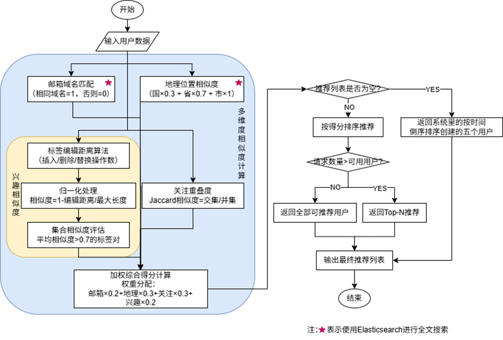

## 文章推荐算法设计

## 用户推荐算法设计

## DeepSeek微调模型效果
背景：针对通用大模型在专业领域表现不足，采用LoRA方法对DeepSeek模型进行领域适配微调，提升摘要生成准确性。  
微调数据集：使用CASSum数据集（GitHub仓库指路：https://github.com/fpg2012/CASSumhttps://github.com/fpg2012/CASSum
），包含多领域的论文和摘要，共计3601条样本，平均原文长度10746.70字符，摘要长度205.27字符。  
模型训练对比：版本2在学习率0.0001、训练次数8、输入序列最大长度1024的情况下，loss值收敛效果最优，选定为最终使用版本。  
摘要生成性能：微调后模型在ROUGE-1至ROUGE-4指标上全面超越基础模型，尤其在ROUGE-1和ROUGE-4指标上性能提升超过60%，即在单个词以及以4为长度的词组中，微调后的模型能够获得更好的上下文生成和理解能力，显著增强摘要质量。  

## 日志管理实现
日志收集的数据流为：后端应用AOP生成日志->Logback规范日志->Filebeat收集日志->Logstash过滤日志->Elasticsearch里存储日志索引数据  
Kibana数据展示：实时读取Elasticsearch中的日志数据
